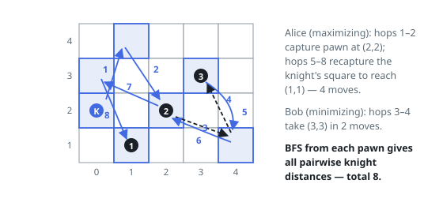

# Solutions — Maximum Number of Moves to Kill All Pawns

## BFS Distance Precomputation with Minimax Bitmask DP

The game state after some moves is fully described by the set of already-captured pawns and the knight's current square, which is always one of the pawns' positions (or the start). So the first step is to precompute pairwise distances: run one BFS over the 50×50 board from each pawn, which yields both the pawn-to-pawn distance matrix and, for free, the distance from the knight's starting square to every pawn (read off each BFS grid at `(kx, ky)`).

The DP is a minimax over subsets. `dp(mask, last)` is the total number of moves still to be made when the pawns in `mask` have been captured and the knight stands on pawn `last`; the turn parity comes from the popcount of `mask` — Alice (maximizing) moves when an even number of pawns has been captured, Bob (minimizing) when it is odd. Each transition picks an un-captured pawn `j`, adds `dist[last][j]` for the capture, and recurses with `j` appended to the mask. The recursion is memoized with `lru_cache`, and the outer loop seeds the search by choosing which pawn Alice takes first, paying the knight's start-to-pawn distance.

Correctness rests on the fact that only the knight's current square matters, never the path taken to it — distances are metric, so each capture simply costs the shortest knight path from the current square to the target. Both players are forced to capture exactly one pawn per turn, so the parity rule exactly alternates the min/max objective, and with at most 15 pawns the `2^m · m` state space is tiny.

Edge cases: a single pawn reduces the answer to the pure start-to-pawn BFS distance; turns where the knight passes over other pawns are free, which BFS naturally allows since intermediate occupancy is irrelevant.

**Complexity:** `O(50² · m + 2^m · m²)` time, `O(2^m · m)` space.
