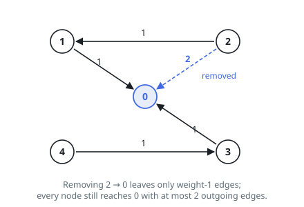
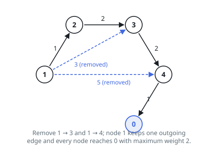

# Minimize the Maximum Edge Weight of Graph

## Description

You are given two integers, `n` and `threshold`, as well as a directed weighted graph of `n` nodes numbered from `0` to `n - 1`. The graph is represented by a 2D integer array `edges`, where `edges[i] = [Ai, Bi, Wi]` indicates that there is an edge going from node `Ai` to node `Bi` with weight `Wi`.

You have to remove some edges from this graph (possibly none), so that it satisfies the following conditions:

- Node `0` must be reachable from all other nodes.
- The maximum edge weight in the resulting graph is minimized.
- Each node has at most `threshold` outgoing edges.

Return the minimum possible value of the maximum edge weight after removing the necessary edges. If it is impossible for all conditions to be satisfied, return `-1`.

### Example 1

```text
Input: n = 5, edges = [[1,0,1],[2,0,2],[3,0,1],[4,3,1],[2,1,1]], threshold = 2
Output: 1
Explanation: Remove the edge 2 -> 0. The maximum weight among the remaining edges is 1.
```



### Example 2

```text
Input: n = 5, edges = [[0,1,1],[0,2,2],[0,3,1],[0,4,1],[1,2,1],[1,4,1]], threshold = 1
Output: -1
Explanation: It is impossible to reach node 0 from node 2.
```

### Example 3

```text
Input: n = 5, edges = [[1,2,1],[1,3,3],[1,4,5],[2,3,2],[3,4,2],[4,0,1]], threshold = 1
Output: 2
Explanation: Remove the edges 1 -> 3 and 1 -> 4. The maximum weight among the remaining edges is 2.
```



### Example 4

```text
Input: n = 5, edges = [[1,2,1],[1,3,3],[1,4,5],[2,3,2],[4,0,1]], threshold = 1
Output: -1
```

### Constraints

- `2 <= n <= 10⁵`
- `1 <= threshold <= n - 1`
- `1 <= edges.length <= min(10⁵, n * (n - 1) / 2)`
- `edges[i].length == 3`
- `0 <= Ai, Bi < n`
- `Ai != Bi`
- `1 <= Wi <= 10⁶`
- There may be multiple edges between a pair of nodes, but they must have unique weights.

## Hints

### Hint 1

Can we use binary search on the maximum edge weight?

### Hint 2

Invert the edges in the graph so node 0 must reach every other node.
