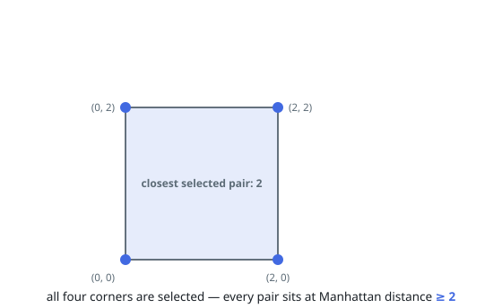
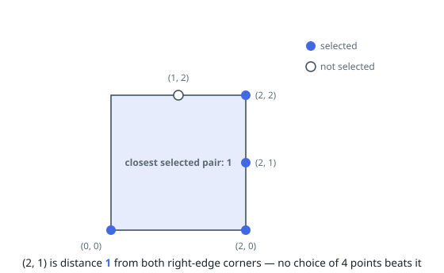
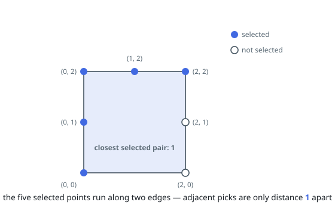

# Maximize the Distance Between Points on a Square

## Description

You are given an integer `side`, representing the edge length of a square with
corners at `(0, 0)`, `(0, side)`, `(side, 0)`, and `(side, side)` on a
Cartesian plane.

You are also given a positive integer `k` and a 2D integer array `points`,
where `points[i] = [xi, yi]` represents the coordinate of a point lying on the
boundary of the square.

You need to select `k` elements among `points` such that the minimum Manhattan
distance between any two points is maximized.

Return the maximum possible minimum Manhattan distance between the selected
`k` points.

The Manhattan Distance between two cells `(xi, yi)` and `(xj, yj)` is
`|xi - xj| + |yi - yj|`.

### Example 1

```text
Input: side = 2, points = [[0,2],[2,0],[2,2],[0,0]], k = 4
Output: 2
Explanation: Select all four points.
```



### Example 2

```text
Input: side = 2, points = [[0,0],[1,2],[2,0],[2,2],[2,1]], k = 4
Output: 1
Explanation: Select the points (0, 0), (2, 0), (2, 2), and (2, 1).
```



### Example 3

```text
Input: side = 2, points = [[0,0],[0,1],[0,2],[1,2],[2,0],[2,2],[2,1]], k = 5
Output: 1
Explanation: Select the points (0, 0), (0, 1), (0, 2), (1, 2), and (2, 2).
```



### Constraints

- `1 <= side <= 10^9`
- `4 <= points.length <= min(4 * side, 15 * 10^3)`
- `points[i] == [xi, yi]`
- The input is generated such that:
    - `points[i]` lies on the boundary of the square.
    - All `points[i]` are unique.
- `4 <= k <= min(25, points.length)`

## Hints

### Hint 1

Can we use binary search for this problem?

### Hint 2

Think of the coordinates on a straight line in clockwise order.

### Hint 3

Binary search on the minimum Manhattan distance x.

### Hint 4

During the binary search, for each coordinate, find the immediate next coordinate with distance >= x.

### Hint 5

Greedily select up to k coordinates.
