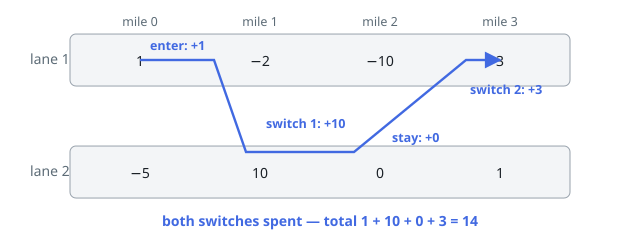

# Solutions — Maximum Coin Collection

## Lane DP with a Switch Budget

Because a ride moves one mile per move and can never stand still, at every mile the rider occupies exactly one lane, and the only choice that matters is which lane and how many switches remain — `dp[lane][r]`, the best coin total of a ride ending at the current mile in that lane with `r` switches still unused. Transitions between consecutive miles are local: stay in the same lane (cost 0 switches) or cross to the other lane (cost one switch, `r -> r - 1`), adding the current mile's value of the destination lane. This is the standard "finite-state automaton over positions" DP, with only `2 * 3 = 6` live states, so rolling arrays of size 3 per lane suffice.

Two details make it match the problem exactly. First, the ride may begin at any mile, so each mile injects two fresh states: enter on lane 1 with the full budget of 2 switches (`cur1[2] = v1`) or enter and immediately switch to lane 2 with 1 switch left (`cur2[1] = v2`) — the immediate switch is allowed because switching is permitted "upon entering". Second, the ride may end at any mile, so the global answer is the maximum over all six states at every mile, not the final-mile state.

Infeasible combinations are kept as negative infinity: a state that was never started stays `-inf` and never propagates through the `max` operations, so the DP never invents rides that use more than two switches or start mid-lane-2. Since every ride must cover at least one mile and the fresh-start injection happens at every mile, `best` is always updated at mile 0 and the answer is well-defined even when all values are negative (example 5 returns -2).

Edge cases: rides shorter than the freeway (handled by taking the max at each mile), entering and immediately switching (example 3), and switching twice to return to lane 1 for a profitable tail (example 1). All fall out of the same transition set.

**Complexity:** `O(n)` time, `O(1)` space.
