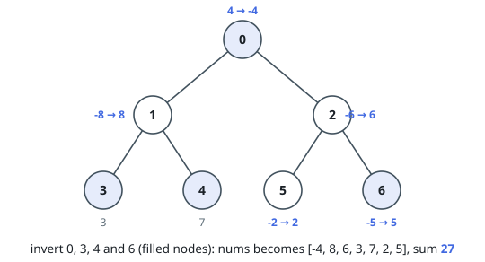
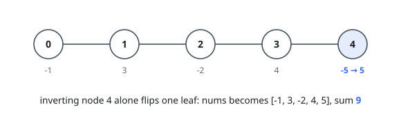

# Subtree Inversion Sum

## Description

You are given an undirected tree rooted at node `0`, with `n` nodes numbered from `0` to `n - 1`. The tree is represented by a 2D integer array `edges` of length `n - 1`, where `edges[i] = [ui, vi]` indicates an edge between nodes `ui` and `vi`.

You are also given an integer array `nums` of length `n`, where `nums[i]` represents the value at node `i`, and an integer `k`.

You may perform inversion operations on a subset of nodes subject to the following rules:

- **Subtree Inversion Operation:** When you invert a node, every value in the subtree rooted at that node is multiplied by `-1`.
- **Distance Constraint on Inversions:** You may only invert a node if it is "sufficiently far" from any other inverted node. Specifically, if you invert two nodes `a` and `b` such that one is an ancestor of the other (i.e., if `LCA(a, b) = a` or `LCA(a, b) = b`), then the distance (the number of edges on the unique path between them) must be at least `k`.

Return the maximum possible sum of the tree's node values after applying inversion operations.

### Example 1

```text
Input: edges = [[0,1],[0,2],[1,3],[1,4],[2,5],[2,6]], nums = [4,-8,-6,3,7,-2,5], k = 2
Output: 27
Explanation: Apply inversion operations at nodes 0, 3, 4 and 6. The final nums
array is [-4, 8, 6, 3, 7, 2, 5], and the total sum is 27.
```



### Example 2

```text
Input: edges = [[0,1],[1,2],[2,3],[3,4]], nums = [-1,3,-2,4,-5], k = 2
Output: 9
Explanation: Apply the inversion operation at node 4. The final nums array
becomes [-1, 3, -2, 4, 5], and the total sum is 9.
```



### Example 3

```text
Input: edges = [[0,1],[0,2]], nums = [0,-1,-2], k = 3
Output: 3
Explanation: Apply inversion operations at nodes 1 and 2.
```

### Constraints

- `2 <= n <= 5 * 10⁴`
- `edges.length == n - 1`
- `edges[i] = [ui, vi]`
- `0 <= ui, vi < n`
- `nums.length == n`
- `-5 * 10⁴ <= nums[i] <= 5 * 10⁴`
- `1 <= k <= 50`
- The input is generated such that `edges` represents a valid tree.

## Hints

### Hint 1

Use tree-based dynamic programming.

### Hint 2

Define your DP state as dp[node][parityFromAncestorInversions][distSinceLastInversion].

### Hint 3

parityFromAncestorInversions indicates whether the subtree values have been flipped an even (0) or odd (1) number of times by ancestor inversions.

### Hint 4

distSinceLastInversion tracks the number of edges from this node up to the most recent ancestor inversion.
