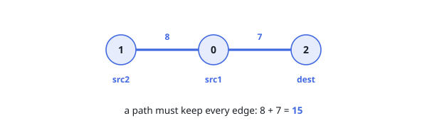

# Minimum Weighted Subgraph With the Required Paths II

## Description

You are given an undirected weighted tree with `n` nodes, numbered from `0` to
`n - 1`. The tree is represented by a 2D integer array `edges` of length
`n - 1`, where `edges[i] = [ui, vi, wi]` indicates that there is an edge
between nodes `ui` and `vi` with weight `wi`.

You are also given a 2D integer array `queries`, where
`queries[j] = [src1j, src2j, destj]`.

Return an array `answer` of length equal to `queries.length`, where
`answer[j]` is the minimum total weight of a subtree such that it is possible
to reach `destj` from both `src1j` and `src2j` using edges in this subtree.

A subtree here is any connected subset of nodes and edges of the original tree
forming a valid tree.

### Example 1

```text
Input: edges = [[0,1,2],[1,2,3],[1,3,5],[1,4,4],[2,5,6]], queries = [[2,3,4],[0,2,5]]
Output: [12,11]
Explanation:
answer[0]: The minimum subtree that connects src1 = 2, src2 = 3 and dest = 4 uses the edges of weights 3, 5 and 4, for a total of 12.
answer[1]: The minimum subtree that connects src1 = 0, src2 = 2 and dest = 5 uses the edges of weights 2, 3 and 6, for a total of 11.
```

![The same tree twice: query [2, 3, 4] keeps edges of weight 3 + 5 + 4 = 12, and query [0, 2, 5] keeps edges of weight 2 + 3 + 6 = 11.](figures/example-1.svg)

### Example 2

```text
Input: edges = [[1,0,8],[0,2,7]], queries = [[0,1,2]]
Output: [15]
Explanation:
The tree is a path 1 - 0 - 2. The subtree connecting src1 = 0, src2 = 1 and dest = 2 must contain both edges, for a total weight of 8 + 7 = 15.
```



### Constraints

- `3 <= n <= 10⁵`
- `edges.length == n - 1`
- `edges[i].length == 3`
- `0 <= ui, vi < n`
- `1 <= wi <= 10⁴`
- `1 <= queries.length <= 10⁵`
- `queries[j].length == 3`
- `0 <= src1j, src2j, destj < n`
- `src1j`, `src2j`, and `destj` are pairwise distinct.
- The input is generated such that `edges` represents a valid tree.

### Follow-up

Can you answer each query in O(log n) after O(n log n) preprocessing?

## Hints

### Hint 1

Root the tree anywhere and compute, for every node, its depth and its
weighted distance `f(x)` from the root. For two nodes, the tree distance is
`d(x, y) = f(x) + f(y) - 2 * f(LCA(x, y))`, so everything reduces to finding
lowest common ancestors quickly.

### Hint 2

The minimal subtree connecting three nodes is exactly the union of the three
paths between each pair, and every edge of that union lies on exactly two of
the three paths — so its total weight is `(d(a, b) + d(b, c) + d(c, a)) / 2`.

### Hint 3

Precompute a binary-lifting ancestor table once, then answer each LCA query in
O(log n): lift the deeper node to the common depth, then jump both nodes up
together while their ancestors differ.
