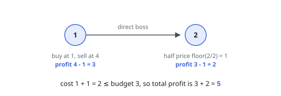
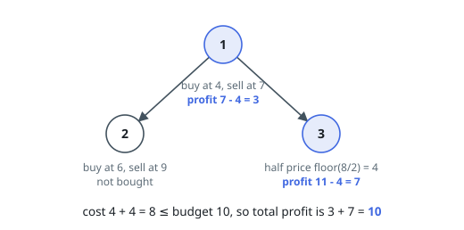
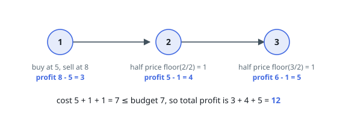

# Maximum Profit from Trading Stocks with Discounts

## Description

You are given an integer `n`, representing the number of employees in a company. Each employee is assigned a unique ID from `1` to `n`, and employee `1` is the CEO, and is the direct or indirect boss of every employee. You are given two 1-based integer arrays, `present` and `future`, each of length `n`, where:

- `present[i]` represents the current price at which the `i`-th employee can buy a stock today.
- `future[i]` represents the expected price at which the `i`-th employee can sell the stock tomorrow.

The company's hierarchy is represented by a 2D integer array `hierarchy`, where `hierarchy[i] = [ui, vi]` means that employee `ui` is the direct boss of employee `vi`.

Additionally, you have an integer `budget` representing the total funds available for investment.

However, the company has a discount policy: if an employee's direct boss purchases their own stock, then the employee can buy their stock at half the original price (`floor(present[v] / 2)`).

Return the maximum profit that can be achieved without exceeding the given `budget`.

Note:

- You may buy each stock at most once.
- You cannot use any profit earned from future stock prices to fund additional investments and must buy only from `budget`.

### Example 1

```text
Input: n = 2, present = [1,2], future = [4,3], hierarchy = [[1,2]], budget = 3
Output: 5
Explanation: Employee 1 buys at price 1 and earns 4 - 1 = 3. Since Employee 1
is the direct boss of Employee 2, Employee 2 gets a discounted price of
floor(2 / 2) = 1 and earns 3 - 1 = 2. The total cost is 1 + 1 = 2 <= budget,
so the maximum profit is 3 + 2 = 5.
```



### Example 2

```text
Input: n = 2, present = [3,4], future = [5,8], hierarchy = [[1,2]], budget = 4
Output: 4
Explanation: Employee 2 buys at price 4 and earns 8 - 4 = 4. Both employees
cannot be bought together (3 + 2 = 5 > budget), so the maximum profit is 4.
```

### Example 3

```text
Input: n = 3, present = [4,6,8], future = [7,9,11], hierarchy = [[1,2],[1,3]], budget = 10
Output: 10
Explanation: Employee 1 buys at price 4 and earns 7 - 4 = 3. Employee 3 gets a
discounted price of floor(8 / 2) = 4 and earns 11 - 4 = 7. The total cost is
4 + 4 = 8 <= budget, so the maximum profit is 3 + 7 = 10.
```



### Example 4

```text
Input: n = 3, present = [5,2,3], future = [8,5,6], hierarchy = [[1,2],[2,3]], budget = 7
Output: 12
Explanation: Employee 1 buys at price 5 and earns 8 - 5 = 3. Employee 2 gets a
discounted price of floor(2 / 2) = 1 and earns 5 - 1 = 4. Employee 3 gets a
discounted price of floor(3 / 2) = 1 and earns 6 - 1 = 5. The total cost is
5 + 1 + 1 = 7 <= budget, so the maximum profit is 3 + 4 + 5 = 12.
```



### Constraints

- `1 <= n <= 160`
- `present.length, future.length == n`
- `1 <= present[i], future[i] <= 50`
- `hierarchy.length == n - 1`
- `hierarchy[i] == [ui, vi]`
- `1 <= ui, vi <= n`
- `ui != vi`
- `1 <= budget <= 160`
- There are no duplicate edges.
- Employee `1` is the direct or indirect boss of every employee.
- The input graph `hierarchy` is guaranteed to have no cycles.

## Hints

### Hint 1

Compute max_profit[u] and max_profit1[u] for each node u.

### Hint 2

max_profit[u] = maximum profit in the subtree of u assuming the parent of u has not bought the stock.

### Hint 3

max_profit1[u] = maximum profit in the subtree of u assuming the parent of u has bought the stock.

### Hint 4

For each node u, consider two cases: buy the stock for u (at present[u] if the parent did not buy, or at floor(present[u]/2) if the parent bought), then add the best max_profit1 values of its children; or skip buying for u, then add the best max_profit values of its children.
