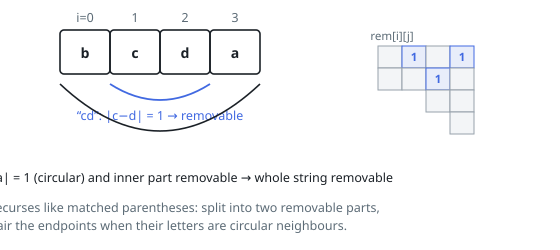

# Solutions — Lexicographically Smallest String After Adjacent Removals

## Interval Removability DP with Greedy Prefix Selection

The first question is which substrings can disappear entirely. rem[i][j] marks that s[i..j] can be fully removed by repeated operations, and it is filled by an interval DP over increasing lengths: either the interval splits at some k into two independently removable parts, or the two endpoint characters are consecutive in the circular alphabet (absolute letter difference 1, or 25 for the 'a'–'z' pair) and the inner interval s[i+1..j−1] is itself removable — the endpoints pair up like matched parentheses. Length-2 intervals need only the endpoint test.

The answer string is then built right to left: ans[i], the lexicographically smallest string obtainable from the suffix starting at i, is the minimum over all j of s[j] + ans[j+1], where the prefix s[i..j−1] must be fully removable (the j = i case keeps s[i] and requires nothing). Comparing the candidate strings directly — not just their next characters — resolves ties correctly because ans[j+1] is already optimal for each split point. The empty candidate is allowed when the whole remaining suffix is removable.

The maximally-deleted string is not always the answer (deleting "dc" from "zdce" leaves "ze", which is larger than "zdce"), which is exactly why every split point must be considered rather than removing greedily. The comparison work makes the second phase O(n³) in the worst case, fine for n ≤ 250; strings of length at most 1 are returned unchanged.

**Complexity:** `O(n³)` time, `O(n²)` space.
