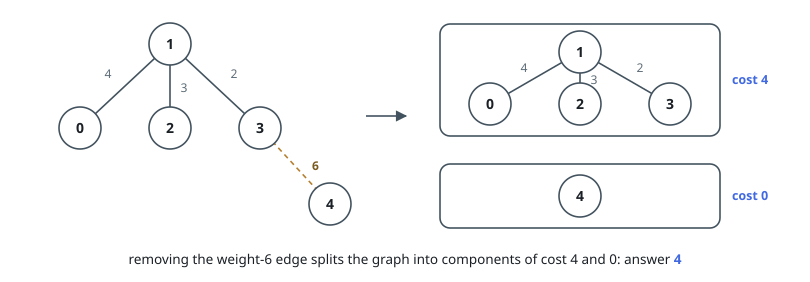
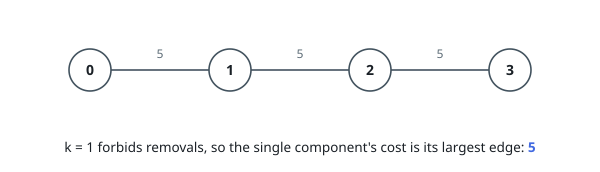

# Minimize Maximum Component Cost

## Description

You are given an undirected connected graph with `n` nodes labeled from `0` to
`n - 1` and a 2D integer array `edges` where `edges[i] = [ui, vi, wi]` denotes
an undirected edge between node `ui` and node `vi` with weight `wi`, and an
integer `k`.

You are allowed to remove any number of edges from the graph such that the
resulting graph has at most `k` connected components.

The cost of a component is defined as the maximum edge weight in that
component. If a component has no edges, its cost is `0`.

Return the minimum possible value of the maximum cost among all components
after such removals.

### Example 1

```text
Input: n = 5, edges = [[0,1,4],[1,2,3],[1,3,2],[3,4,6]], k = 2
Output: 4
Explanation:
Remove the edge between nodes 3 and 4 (weight 6).
The resulting components have costs of 0 and 4, so the overall maximum cost is 4.
```



### Example 2

```text
Input: n = 4, edges = [[0,1,5],[1,2,5],[2,3,5]], k = 1
Output: 5
Explanation:
No edge can be removed, since allowing only one component (k = 1) requires the graph to stay fully connected.
That single component's cost equals its largest edge weight, which is 5.
```



### Constraints

- `1 <= n <= 5 * 10^4`
- `0 <= edges.length <= 10^5`
- `edges[i].length == 3`
- `0 <= ui, vi < n`
- `1 <= wi <= 10^6`
- `1 <= k <= n`
- The input graph is connected.

## Hints

### Hint 1

Binary-search the candidate maximum component cost.

### Hint 2

For a threshold mid, keep only edges with weight <= mid and count the resulting connected components with a union-find.

### Hint 3

The threshold is feasible exactly when that component count is at most k.
