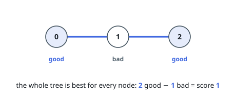
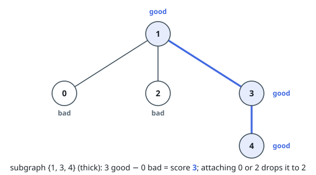
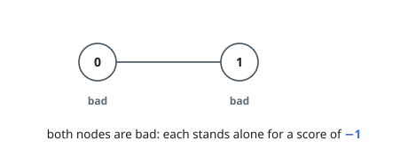

# Maximum Subgraph Score in a Tree

## Description

You are given an undirected tree with `n` nodes, numbered from `0` to
`n - 1`. It is represented by a 2D integer array `edges` of length `n - 1`,
where `edges[i] = [ai, bi]` indicates that there is an edge between nodes `ai`
and `bi` in the tree.

You are also given an integer array `good` of length `n`, where `good[i]` is
`1` if the `i`-th node is good, and `0` if it is bad.

Define the score of a subgraph as the number of good nodes minus the number of
bad nodes in that subgraph.

For each node `i`, find the maximum possible score among all connected
subgraphs that contain node `i`.

Return an array of `n` integers where the `i`-th element is the maximum score
for node `i`.

A subgraph is a graph whose vertices and edges are subsets of the original
graph.

A connected subgraph is a subgraph in which every pair of its vertices is
reachable from one another using only its edges.

### Example 1

```text
Input: n = 3, edges = [[0,1],[1,2]], good = [1,0,1]
Output: [1,1,1]
Explanation:
For each node, the best connected subgraph containing it is the whole tree, which has 2 good nodes and 1 bad node, resulting in a score of 1.
```



### Example 2

```text
Input: n = 5, edges = [[1,0],[1,2],[1,3],[3,4]], good = [0,1,0,1,1]
Output: [2,3,2,3,3]
Explanation:
Node 0: The best connected subgraph consists of nodes 0, 1, 3, 4, which has 3 good nodes and 1 bad node, resulting in a score of 3 - 1 = 2.
Nodes 1, 3, and 4: The best connected subgraph consists of nodes 1, 3, 4, which has 3 good nodes, resulting in a score of 3.
Node 2: The best connected subgraph consists of nodes 1, 2, 3, 4, which has 3 good nodes and 1 bad node, resulting in a score of 3 - 1 = 2.
```



### Example 3

```text
Input: n = 2, edges = [[0,1]], good = [0,0]
Output: [-1,-1]
Explanation:
For each node, including the other node only adds another bad node, so the best score for both nodes is -1.
```



### Constraints

- `2 <= n <= 10^5`
- `edges.length == n - 1`
- `edges[i] = [ai, bi]`
- `0 <= ai, bi < n`
- `good.length == n`
- `0 <= good[i] <= 1`
- The input is generated such that `edges` represents a valid tree.

## Hints

### Hint 1

Root the tree and compute, for every node, the maximum score of a connected subgraph inside its subtree that contains it.

### Hint 2

Use rerooting dynamic programming: for each child, compute the best parent-side subgraph that can attach to it, then combine.
