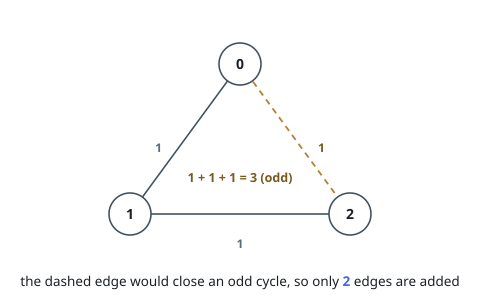
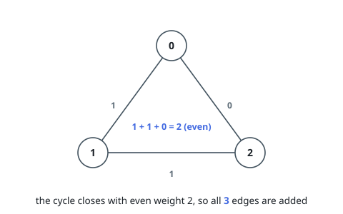

# Incremental Even-Weighted Cycle Queries

## Description

You are given a positive integer `n`.

There is an undirected graph with `n` nodes labeled from `0` to `n - 1`.
Initially, the graph has no edges.

You are also given a 2D integer array `edges`, where
`edges[i] = [ui, vi, wi]` represents an edge between nodes `ui` and `vi` with
weight `wi`. The weight `wi` is either `0` or `1`.

Process the edges in `edges` in the given order. For each edge, add it to the
graph only if, after adding it, the sum of the weights of the edges in every
cycle in the resulting graph is even.

Return an integer denoting the number of edges that are successfully added to
the graph.

### Example 1

```text
Input: n = 3, edges = [[0,1,1],[1,2,1],[0,2,1]]
Output: 2
Explanation:
[0, 1, 1]: We add the edge between vertex 0 and vertex 1 with weight 1.
[1, 2, 1]: We add the edge between vertex 1 and vertex 2 with weight 1.
[0, 2, 1]: The edge between vertex 0 and vertex 2 is not added because the
cycle 0 - 1 - 2 - 0 has total edge weight 1 + 1 + 1 = 3, which is an odd number.
```



### Example 2

```text
Input: n = 3, edges = [[0,1,1],[1,2,1],[0,2,0]]
Output: 3
Explanation:
[0, 1, 1]: We add the edge between vertex 0 and vertex 1 with weight 1.
[1, 2, 1]: We add the edge between vertex 1 and vertex 2 with weight 1.
[0, 2, 0]: We add the edge between vertex 0 and vertex 2 with weight 0.
Note that the cycle 0 - 1 - 2 - 0 has total edge weight 1 + 1 + 0 = 2, which is
an even number.
```



### Constraints

- `3 <= n <= 5 * 10^4`
- `1 <= edges.length <= 5 * 10^4`
- `edges[i] = [ui, vi, wi]`
- `0 <= ui < vi < n`
- All edges are distinct.
- `wi = 0` or `wi = 1`

## Hints

### Hint 1

Model as parity constraints: assign bits to nodes, a 0-edge requires the same bit and a 1-edge different bits.

### Hint 2

Use DSU to track connected components and relative parities; reject an edge if adding it contradicts the parity of an existing path.

### Hint 3

Adding an edge either merges two components or checks that the existing path parity matches the new edge's weight.
