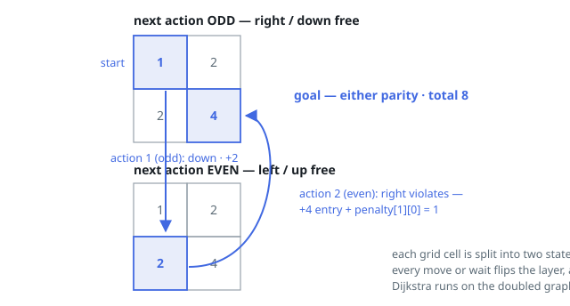

# Solutions — Minimum Cost Path with Alternating Directions III

## Dijkstra with Parity States

The alternating rule makes the cheapest path depend not only on where you are but on which action number comes next, so the solution searches over states `(cell, parity)` where `parity` records whether the next action is odd (move right or down freely) or even (move left or up freely). The search starts at `(0, 0)` with cost `(0 + 1) * (0 + 1) = 1` — the entrance cost paid up front — and parity "next action odd", since actions are numbered from 1. Every action, move or wait, flips the parity bit.

From state `(i, j, parity)` there are five transitions: four moves to adjacent cells and one wait. A move costs just the destination's entrance cost `(ni + 1) * (nj + 1)` when its direction obeys the current parity rule (right/down on an odd action, left/up on an even one), and that entrance cost plus `penalty[i][j]` — the penalty of the cell being left — when it violates the rule. Waiting costs `penalty[i][j]` and is the cheap way to re-time the sequence: it flips parity in place, which matters whenever paying a small penalty lets subsequent moves all follow the rule. All edge weights are non-negative, so Dijkstra with a min-heap computes exact shortest distances over the `2 * m * n` states; stale heap entries are discarded by comparing against the recorded distance, and the destination cell is never expanded once popped.

The answer is the smaller of the two distances recorded at `(m - 1, n - 1)`, because arriving with either next-action parity is acceptable — the process simply stops there. The constraint `m * n <= 10^5` bounds the state graph to at most `2 * 10^5` nodes with five outgoing edges each, which Dijkstra handles comfortably even though `m` and `n` can individually reach `10^5`.

**Complexity:** `O(m * n * log(m * n))` time, `O(m * n)` space.
