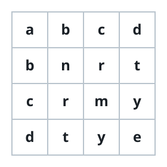
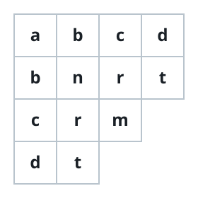
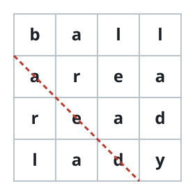

# Symmetric Word Grid

## Description

An array `words` forms a *word square* when reading each row matches reading
the corresponding column. For every position `k`, the `k`th word of the array
and the `k`th vertical column must read the same sequence of letters. Return
`true` if `words` is a word square and `false` otherwise.

Rows may have different lengths, so a column simply ends when a shorter row
runs out of letters.

### Example 1



```text
Input: words = ["abcd","bnrt","crmy","dtye"]
Output: true
Explanation: Each row matches its column: row 0 and column 0 both read
"abcd", row 1 and column 1 both read "bnrt", and so on.
```

### Example 2



```text
Input: words = ["abcd","bnrt","crm","dt"]
Output: true
Explanation: Row 3 holds only "dt" and column 3 holds only "dt" as well,
which is allowed.
```

### Example 3



```text
Input: words = ["ball","area","read","lady"]
Output: false
Explanation: Row 2 reads "read" while column 2 reads "lead", so the grid is
not symmetric.
```

### Constraints

- `1 <= words.length <= 500`
- `1 <= words[i].length <= 500`
- `words[i]` consists of only lowercase English letters.
