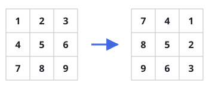

# Rotate Image

## Description

You are given an `n x n` 2D `matrix` representing an image, rotate the image by 90 degrees (clockwise).

You have to rotate the image **in-place**, which means you have to modify the input 2D `matrix` directly. DO NOT allocate another 2D matrix and do the rotation.

On LeetCode the function returns nothing and the judge inspects the mutated matrix; here the judge observes only the return value, so rotate `matrix` in place and return it — the returned matrix is the rotated image.

### Example 1



```text
Input: matrix = [[1,2,3],[4,5,6],[7,8,9]]
Output: [[7,4,1],[8,5,2],[9,6,3]]
```

### Example 2


```text
Input: matrix = [[5,1,9,11],[2,4,8,10],[13,3,6,7],[15,14,12,16]]
Output: [[15,13,2,5],[14,3,4,1],[12,6,8,9],[16,7,10,11]]
```

### Constraints

- `n == matrix.length == matrix[i].length`
- `1 <= n <= 20`
- `-1000 <= matrix[i][j] <= 1000`
