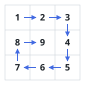

# Spiral Matrix II

## Description

Given a positive integer `n`, generate an `n x n` matrix filled with elements from `1` to `n²` in spiral order.

### Example 1



```text
Input: n = 3
Output: [[1,2,3],[8,9,4],[7,6,5]]
```

### Example 2

```text
Input: n = 1
Output: [[1]]
```

### Constraints

- `1 <= n <= 20`
