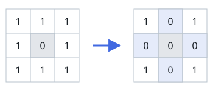

# Set Matrix Zeroes

## Description

Given an `m x n` integer matrix `matrix`, if an element is `0`, set its entire
row and column to `0`'s.

You must do it **in place**.

On LeetCode the function returns nothing and the judge inspects the mutated matrix; here the judge observes only the return value, so zero `matrix` in place and return it — the returned matrix is the zeroed matrix.

### Example 1



```text
Input: matrix = [[1,1,1],[1,0,1],[1,1,1]]
Output: [[1,0,1],[0,0,0],[1,0,1]]
```

### Example 2


```text
Input: matrix = [[0,1,2,0],[3,4,5,2],[1,3,1,5]]
Output: [[0,0,0,0],[0,4,5,0],[0,3,1,0]]
```

### Constraints

- `m == matrix.length`
- `n == matrix[0].length`
- `1 <= m, n <= 200`
- `-2³¹ <= matrix[i][j] <= 2³¹ - 1`

### Follow-up

A straightforward solution using O(mn) space is probably a bad idea.
A simple improvement uses O(m + n) space, but still not the best solution.
Could you devise a constant space solution?

## Hints

### Hint 1

If any cell of the matrix has a zero we can record its row and column number using additional memory. But if you don't want to use extra memory then you can manipulate the array instead. i.e. simulating exactly what the question says.

### Hint 2

Setting cell values to zero on the fly while iterating might lead to discrepancies. What if you use some other integer value as your marker? There is still a better approach for this problem with O(1) space.

### Hint 3

We could have used 2 sets to keep a record of rows/columns which need to be set to zero. But for an O(1) space solution, you can use one of the rows and and one of the columns to keep track of this information.

### Hint 4

We can use the first cell of every row and column as a flag. This flag would determine whether a row or column has been set to zero.
