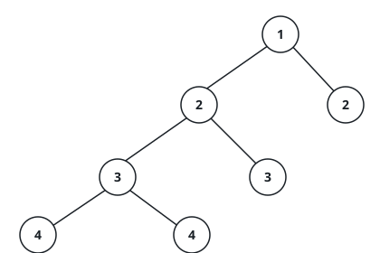

# Balanced Binary Tree

## Description

Given a binary tree, determine if it is height-balanced.

A **height-balanced binary tree** is defined as a binary tree in which the left
and the right subtrees of every node differ in height by no more than 1.

### Example 1


```text
Input: root = [3,9,20,null,null,15,7]
Output: true
```

### Example 2



```text
Input: root = [1,2,2,3,3,null,null,4,4]
Output: false
```

### Example 3

```text
Input: root = []
Output: true
```

### Constraints

- The number of nodes in the tree is in the range `[0, 5000]`.
- `-10⁴ <= Node.val <= 10⁴`
