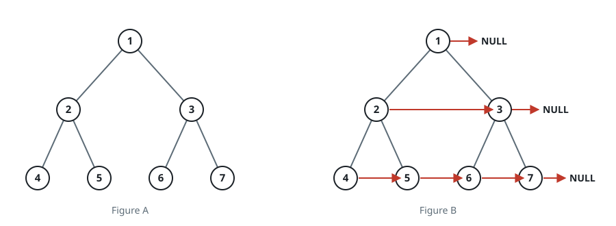

# Populating Next Right Pointers in Each Node

## Description

You are given a perfect binary tree where all leaves are on the same level, and every parent has two children. The binary tree has the following definition:

```text
struct Node {
  int val;
  Node *left;
  Node *right;
  Node *next;
}
```

Populate each next pointer to point to its next right node. If there is no next right node, the next pointer should be set to NULL.

Initially, all next pointers are set to NULL.

On this wire the tree crosses as a level-order array of values; the returned
tree serializes level by level through the populated `next` pointers, with
`null` marking the end of each level and the trailing marker trimmed.

### Example 1



```text
Input: root = [1,2,3,4,5,6,7]
Output: [1, null, 2, 3, null, 4, 5, 6, 7]
Explanation: Given the above perfect binary tree, your function should populate each next pointer to point to its next right node. The serialized output is in level order as connected by the next pointers, with null signifying the end of each level.
```

### Example 2

```text
Input: root = []
Output: []
```

### Constraints

- The number of nodes in the tree is in the range `[0, 2¹² - 1]`.
- `-1000 <= Node.val <= 1000`

### Follow up

- You may only use constant extra space.
- The recursive approach is fine. You may assume implicit stack space does not count as extra space for this problem.
