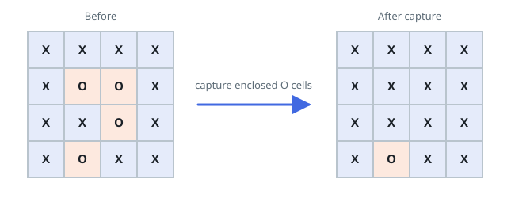

# Surrounded Regions

## Description

You are given an `m x n` matrix `board` containing letters `'X'` and `'O'`, capture regions that are surrounded:

- **Connect:** A cell is connected to adjacent cells horizontally or vertically.
- **Region:** To form a region connect every `'O'` cell.
- **Surround:** A region is surrounded if none of the `'O'` cells in that region are on the edge of the board. Such regions are completely enclosed by `'X'` cells.

To capture a surrounded region, replace all `'O'`s with `'X'`s **in-place** within the original board.

On LeetCode the function returns nothing and the judge inspects the mutated board; here the judge observes only the return value, so capture `board` in place and return it — the returned board is the captured board.

### Example 1

```text
Input: board = [["X","X","X","X"],["X","O","O","X"],["X","X","O","X"],["X","O","X","X"]]
Output: [["X","X","X","X"],["X","X","X","X"],["X","X","X","X"],["X","O","X","X"]]
Explanation: The bottom region is not captured because it is on the edge of the board and cannot be surrounded.
```



### Example 2

```text
Input: board = [["X"]]
Output: [["X"]]
```

### Constraints

- `m == board.length`
- `n == board[i].length`
- `1 <= m, n <= 200`
- `board[i][j]` is `'X'` or `'O'`.
