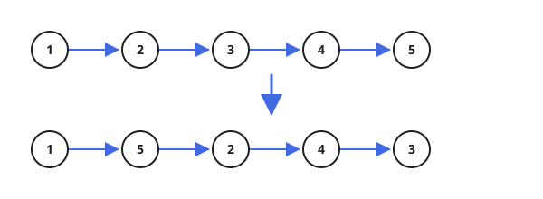

# Reorder List

## Description

You are given the `head` of a singly linked-list. The list can be represented as:

L0 → L1 → … → Ln - 1 → Ln

Reorder the list to be on the following form:

L0 → Ln → L1 → Ln - 1 → L2 → Ln - 2 → …

You may not modify the values in the list's nodes. Only nodes themselves may be changed.

On LeetCode the function returns nothing and the judge inspects the mutated list; here the judge observes only the return value, so reorder the list in place and return `head` — the returned list is the reordered one.

### Example 1


```text
Input: head = [1,2,3,4]
Output: [1,4,2,3]
```

### Example 2



```text
Input: head = [1,2,3,4,5]
Output: [1,5,2,4,3]
```

### Constraints

- The number of nodes in the list is in the range `[1, 5 × 10⁴]`.
- `1 <= Node.val <= 1000`
