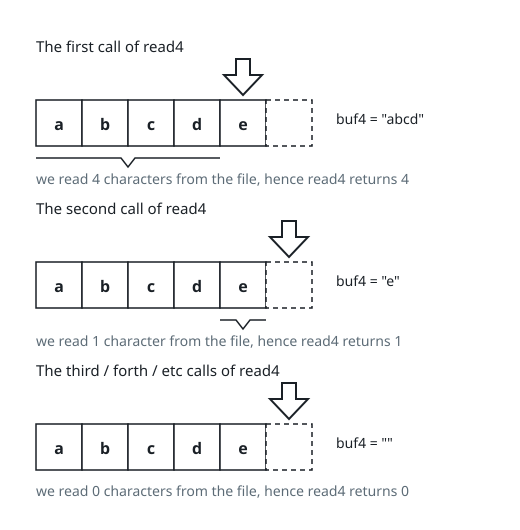

# Read N Characters Given read4 II - Call Multiple Times

## Description

Given a file and assume that you can only read the file using a given method read4, implement a method read to read n characters. Your method read may be called multiple times.

Method read4:

The API read4 reads four consecutive characters from file, then writes those characters into the buffer array buf4.

The return value is the number of actual characters read.

Note that read4() has its own file pointer, much like FILE \*fp in C.

Definition of read4:

```text
Parameter:  char[] buf4
Returns:    int
```

buf4[] is a destination, not a source. The results from read4 will be copied to buf4[].

Below is a high-level example of how read4 works:



```text
File file("abcde"); // File is "abcde", initially file pointer (fp) points to 'a'
char[] buf4 = new char[4]; // Create buffer with enough space to store characters
read4(buf4); // read4 returns 4. Now buf4 = "abcd", fp points to 'e'
read4(buf4); // read4 returns 1. Now buf4 = "e", fp points to end of file
read4(buf4); // read4 returns 0. Now buf4 = "", fp points to end of file
```

Method read:

By using the read4 method, implement the method read that reads n characters from file and store it in the buffer array buf. Consider that you cannot manipulate file directly.

The return value is the number of actual characters read.

Definition of read:

```text
Parameters: char[] buf, int n
Returns:    int
```

buf[] is a destination, not a source. You will need to write the results to buf[].

Note:

- Consider that you cannot manipulate the file directly. The file is only accessible for read4 but not for read.
- The read function may be called multiple times.
- Please remember to RESET your class variables declared in Solution, as static/class variables are persisted across multiple test cases. Please see here for more details.
- You may assume the destination buffer array, buf, is guaranteed to have enough space for storing n characters.
- It is guaranteed that in a given test case the same buffer buf is called by read.

On the judge wire, the file is given as `content`, the array of its characters, and one test case is the whole sequence of `read` calls: your `read` receives the judge-built `file` object exposing `read4(buf4)`, the request list `queries`, and the destination `buf`. Service the requests in order — each one is one `read(buf, n)` call for its own `n`, the characters it reads continue in `buf` right after those of the previous request, and characters left over in your four-character scratch must survive from one request to the next. Return the total number of characters read; the judged result is the pair `[total, buf[:total]]`.

### Example 1

#### Input

```text
{"content": ["a", "b", "c"], "capacity": 4, "queries": [1, 2, 1]}
```

#### Output

```text
[3, ["a", "b", "c"]]
```

Explanation: The test case represents the following scenario:

```text
File file("abc");
Solution sol;
sol.read(buf, 1); // After calling your read method, buf should contain "a". We read a total of 1 character from the file, so return 1.
sol.read(buf, 2); // Now buf should contain "bc". We read a total of 2 characters from the file, so return 2.
sol.read(buf, 1); // We have reached the end of file, no more characters can be read. So return 0.
```

Assume buf is allocated and guaranteed to have enough space for storing all characters from the file.

### Example 2

#### Input

```text
{"content": ["a", "b", "c"], "capacity": 5, "queries": [4, 1]}
```

#### Output

```text
[3, ["a", "b", "c"]]
```

Explanation: The test case represents the following scenario:

```text
File file("abc");
Solution sol;
sol.read(buf, 4); // After calling your read method, buf should contain "abc". We read a total of 3 characters from the file, so return 3.
sol.read(buf, 1); // We have reached the end of file, no more characters can be read. So return 0.
```

### Constraints

- 1 <= file.length <= 500
- file consist of English letters and digits.
- 1 <= queries.length <= 10
- 1 <= queries[i] <= 500
