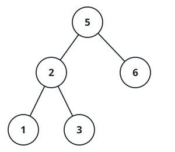

# Verify Preorder Sequence in Binary Search Tree

## Description

Given an array of unique integers `preorder`, return `true` if it is the
correct preorder traversal sequence of a binary search tree.

### Example 1



```text
Input: preorder = [5,2,1,3,6]
Output: true
```

### Example 2

```text
Input: preorder = [5,2,6,1,3]
Output: false
```

### Constraints

- `1 <= preorder.length <= 10⁴`
- `1 <= preorder[i] <= 10⁴`
- All the elements of `preorder` are unique.

### Follow-up

Could you do it using only constant space complexity?
