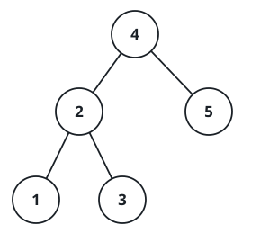

# Closest Binary Search Tree Value

## Description

Given the `root` of a binary search tree and a target value, return the value
in the BST that is closest to the target. If there are multiple answers,
print the smallest.

### Example 1



```text
Input: root = [4,2,5,1,3], target = 3.714286
Output: 4
```

### Example 2

```text
Input: root = [1], target = 4.428571
Output: 1
```

### Constraints

- The number of nodes in the tree is in the range `[1, 10⁴]`.
- `0 <= Node.val <= 10⁹`
- `-10⁹ <= target <= 10⁹`
