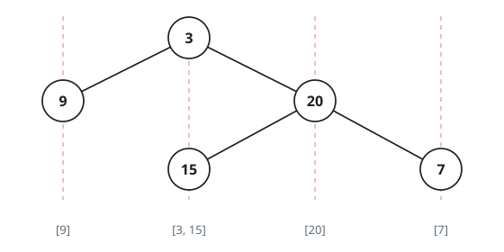

# Binary Tree Vertical Order Traversal

## Description

Given the `root` of a binary tree, return the vertical order traversal of its
nodes' values. (i.e., from top to bottom, column by column).

If two nodes are in the same row and column, the order should be from left to
right.

### Example 1



```text
Input: root = [3,9,20,null,null,15,7]
Output: [[9],[3,15],[20],[7]]
```

### Example 2


```text
Input: root = [3,9,8,4,0,1,7]
Output: [[4],[9],[3,0,1],[8],[7]]
```

### Example 3


```text
Input: root = [1,2,3,4,10,9,11,null,5,null,null,null,null,null,null,null,6]
Output: [[4],[2,5],[1,10,9,6],[3],[11]]
```

### Constraints

- The number of nodes in the tree is in the range `[0, 100]`.
- `-100 <= Node.val <= 100`

## Hints

### Hint 1

Do BFS from the root. Let the root be at column 0. In the BFS, keep in the
queue the node and its column.

### Hint 2

When you traverse a node, store its value in the column index. For example,
the root's value should be stored at index 0.

### Hint 3

If the node has a left node, its column should be col - 1. Similarly, if the
node has a right node, its column should be col + 1.

### Hint 4

At the end, check the minimum and maximum col and output their values.
