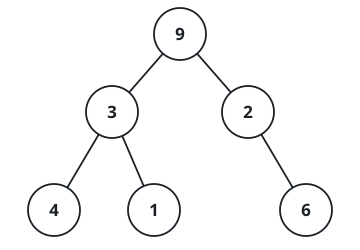

# Verify Preorder Serialization of a Binary Tree

## Description

One way to serialize a binary tree is to use preorder traversal. When we
encounter a non-null node, we record the node's value. If it is a null node,
we record using a sentinel value such as `'#'`.



For example, the binary tree whose root `9` has left child `3` with the leaf
children `4` and `1`, and right child `2` with only a right child `6`, can be
serialized to the string `"9,3,4,#,#,1,#,#,2,#,6,#,#"`, where `'#'` represents
a null node.

Given a string of comma-separated values `preorder`, return `true` if it is a
correct preorder traversal serialization of a binary tree.

It is guaranteed that each comma-separated value in the string must be either
an integer or a character `'#'` representing null pointer.

You may assume that the input format is always valid. For example, it could
never contain two consecutive commas, such as `"1,,3"`.

Note: You are not allowed to reconstruct the tree.

### Example 1

```text
Input: preorder = "9,3,4,#,#,1,#,#,2,#,6,#,#"
Output: true
```

### Example 2

```text
Input: preorder = "1,#"
Output: false
```

### Example 3

```text
Input: preorder = "9,#,#,1"
Output: false
```

### Constraints

- `1 <= preorder.length <= 10⁴`
- `preorder` consist of integers in the range `[0, 100]` and `'#'` separated
  by commas `','`.
