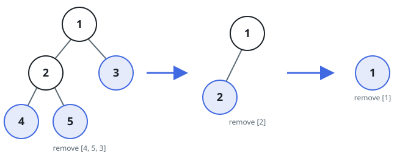

# Find Leaves of Binary Tree

## Description

Given the `root` of a binary tree, collect a tree's nodes as if you were doing
this:

- Collect all the leaf nodes.
- Remove all the leaf nodes.
- Repeat until the tree is empty.

On LeetCode the values within each level may come back in any order; here the
judge compares arrays exactly, so that freedom is pinned to one order — return
each level's values from left to right, in the order a left-to-right
depth-first traversal of the tree visits them.

### Example 1



```text
Input: root = [1,2,3,4,5]
Output: [[4,5,3],[2],[1]]
Explanation: [[3,5,4],[2],[1]] and [[3,4,5],[2],[1]] are also considered
correct answers since per each level it does not matter the order on which
elements are returned.
```

### Example 2

```text
Input: root = [1]
Output: [[1]]
```

### Constraints

- The number of nodes in the tree is in the range `[1, 100]`.
- `-100 <= Node.val <= 100`
