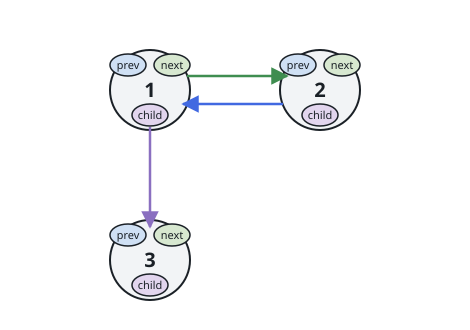

# Flatten a Multilevel Doubly Linked List

## Description

You are given a doubly linked list, which contains nodes that have a next pointer, a previous pointer, and an additional child pointer. This child pointer may or may not point to a separate doubly linked list, also containing these special nodes. These child lists may have one or more children of their own, and so on, to produce a multilevel data structure as shown in the example below.

Given the head of the first level of the list, flatten the list so that all the nodes appear in a single-level, doubly linked list. Let curr be a node with a child list. The nodes in the child list should appear after curr and before curr.next in the flattened list.

Return the head of the flattened list. The nodes in the list must have all of their child pointers set to null.

How the multilevel linked list is represented in test cases:

We use the multilevel linked list from Example 1 below:


```text
 1---2---3---4---5---6--NULL
         |
         7---8---9---10--NULL
             |
             11--12--NULL
```

The serialization of each level is as follows:

```text
[1,2,3,4,5,6,null]
[7,8,9,10,null]
[11,12,null]
```

To serialize all levels together, we will add nulls in each level to signify no node connects to the upper node of the previous level. The serialization becomes:

```text
[1,    2,    3, 4, 5, 6, null]
             |
[null, null, 7,    8, 9, 10, null]
                   |
[            null, 11, 12, null]
```

Merging the serialization of each level and removing trailing nulls we obtain:

```text
[1,2,3,4,5,6,null,null,null,7,8,9,10,null,null,11,12]
```

On this wire the structure crosses explicitly instead of merged: a chain is
`{"values": [...], "children": [...]}` where `children` aligns slot for
slot with `values`, each slot being `null` or another chain object hanging
under that node. The flattened result serializes as the flat list of
values, and `{"values": [], "children": []}` is the empty list.

### Example 1

```text
Input: head = [{"values": [1,2,3,4,5,6], "children": [null,null,{"values": [7,8,9,10], "children": [null,{"values": [11,12], "children": [null,null]},null,null]},null,null,null]}]
Output: [1,2,3,7,8,11,12,9,10,4,5,6]
Explanation: The multilevel linked list in the input is shown.
After flattening the multilevel linked list it becomes:
1-2-3-7-8-11-12-9-10-4-5-6--NULL
```


### Example 2



```text
Input: head = [{"values": [1,2], "children": [{"values": [3], "children": [null]},null]}]
Output: [1,3,2]
Explanation: The multilevel linked list in the input is shown.
After flattening the multilevel linked list it becomes:
1-3-2--NULL
```


### Example 3

```text
Input: head = [{"values": [], "children": []}]
Output: []
Explanation: There could be empty list in the input.
```

### Constraints

- The number of Nodes will not exceed 1000.
- `1 <= Node.val <= 10⁵`
