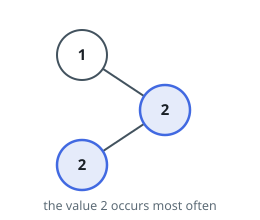

# Find Mode in Binary Search Tree

## Description

Given the `root` of a binary search tree (BST) with duplicates, return all
the mode(s) (i.e., the most frequently occurred element) in it.

If the tree has more than one mode, return them in any order.

On LeetCode the modes may come back in any order; this judge compares
arrays exactly, so return them in ascending sorted order — every answer the
original accepts is the same set of values as this one.

Assume a BST is defined as follows:

- The left subtree of a node contains only nodes with keys less than or
  equal to the node's key.
- The right subtree of a node contains only nodes with keys greater than
  or equal to the node's key.
- Both the left and right subtrees must also be binary search trees.

### Example 1



```text
Input: root = [1,null,2,2]
Output: [2]
```

### Example 2

```text
Input: root = [0]
Output: [0]
```

### Constraints

- The number of nodes in the tree is in the range `[1, 10⁴]`.
- `-10⁵ <= Node.val <= 10⁵`

### Follow-up

Could you do that without using any extra space? (Assume that the implicit
stack space incurred due to recursion does not count.)
