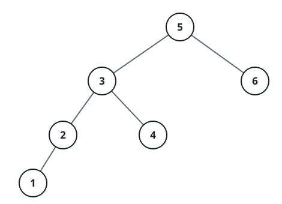

# Inorder Successor in BST II

## Description

Given a node in a binary search tree, return the in-order successor of that node in the BST. If that node has no in-order successor, return null.

The successor of a node is the node with the smallest key greater than node.val.

You will have direct access to the node but not to the root of the tree. Each node will have a reference to its parent node. Below is the definition for Node:

```text
class Node {
    public int val;
    public Node left;
    public Node right;
    public Node parent;
}
```

On this wire the tree crosses as a level-order array of values and the
judge hands the solution the root with every `parent` link wired; the
query node is identified by its value — all values are unique — as the
second argument. The returned successor node crosses as its serialization
through the level walk: its own value, then `null` and the first child
found on each step down, so a leaf successor serializes as just its
value; no in-order successor returns `[]`.

### Example 1


```text
Input: tree = [2,1,3], node = 1
Output: [2, null, 1]
Explanation: 1's in-order successor node is 2. Note that both the node and the return value is of Node type.
```

### Example 2



```text
Input: tree = [5,3,6,2,4,null,null,1], node = 6
Output: []
Explanation: There is no in-order successor of the current node, so the answer is null.
```

### Constraints

- The number of nodes in the tree is in the range `[1, 10⁴]`.
- `-10⁵ <= Node.val <= 10⁵`
- All Nodes will have unique values.

### Follow up

Could you solve it without looking up any of the node's values?
