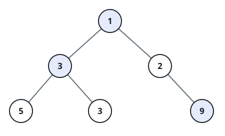

# Find Largest Value in Each Tree Row

## Description

Given the `root` of a binary tree, return an array of the largest value in
each row of the tree (0-indexed).

### Example 1



```text
Input: root = [1,3,2,5,3,null,9]
Output: [1,3,9]
```

### Example 2

```text
Input: root = [1,2,3]
Output: [1,3]
```

### Constraints

- The number of nodes in the tree is in the range `[0, 10⁴]`.
- `-2³¹ <= Node.val <= 2³¹ - 1`
