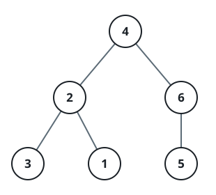

# Construct Binary Tree from String

## Description

You need to construct a binary tree from a string consisting of parenthesis
and integers.

The whole input represents a binary tree. It contains an integer followed by
zero, one or two pairs of parenthesis. The integer represents the root's
value and a pair of parenthesis contains a child binary tree with the same
structure.

You always start to construct the left child node of the parent first if it
exists.

### Example 1



```text
Input: s = "4(2(3)(1))(6(5))"
Output: [4,2,6,3,1,5]
```

### Example 2

```text
Input: s = "4(2(3)(1))(6(5)(7))"
Output: [4,2,6,3,1,5,7]
```

### Example 3

```text
Input: s = "-4(2(3)(1))(6(5)(7))"
Output: [-4,2,6,3,1,5,7]
```

### Constraints

- `0 <= s.length <= 3 * 10⁴`
- `s` consists of digits, `'('`, `')'`, and `'-'` only.
- All numbers in the tree have a value at most `2³⁰`.
