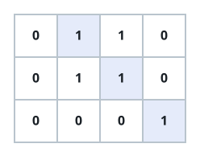

# Longest Line of Consecutive One in Matrix

## Description

Given an `m x n` binary matrix `mat`, return the length of the longest line of
consecutive one in the matrix.

The line could be horizontal, vertical, diagonal, or anti-diagonal.

### Example 1



```text
Input: mat = [[0,1,1,0],[0,1,1,0],[0,0,0,1]]
Output: 3
```

### Example 2


```text
Input: mat = [[1,1,1,1],[0,1,1,0],[0,0,0,1]]
Output: 4
```

### Constraints

- `m == mat.length`
- `n == mat[i].length`
- `1 <= m, n <= 10⁴`
- `1 <= m * n <= 10⁴`
- `mat[i][j]` is either `0` or `1`.
