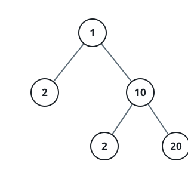

# Equal Tree Partition

## Description

Given the `root` of a binary tree, return `true` if you can partition the tree
into two trees with equal sums of values after removing exactly one edge on
the original tree.

### Example 1


```text
Input: root = [5,10,10,null,null,2,3]
Output: true
```

### Example 2



```text
Input: root = [1,2,10,null,null,2,20]
Output: false
Explanation: You cannot split the tree into two trees with equal sums after
removing exactly one edge on the tree.
```

### Constraints

- The number of nodes in the tree is in the range `[1, 10⁴]`.
- `-10⁵ <= Node.val <= 10⁵`.
