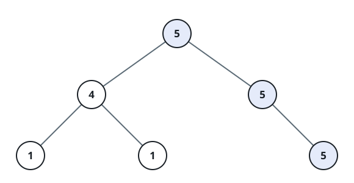
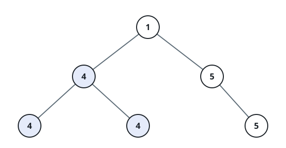

# Longest Univalue Path

## Description

Given the `root` of a binary tree, return the length of the longest path where
each node in the path has the same value. This path may or may not pass
through the root.

The length of the path between two nodes is represented by the number of
edges between them.

### Example 1



```text
Input: root = [5,4,5,1,1,null,5]
Output: 2
Explanation: The longest path of the same value (i.e. 5) runs down the right
spine — two edges.
```

### Example 2



```text
Input: root = [1,4,5,4,4,null,5]
Output: 2
Explanation: The longest path of the same value (i.e. 4) bends under the left
child — two edges.
```

### Constraints

- The number of nodes in the tree is in the range `[0, 10⁴]`.
- `-1000 <= Node.val <= 1000`
- The depth of the tree will not exceed 1000.
