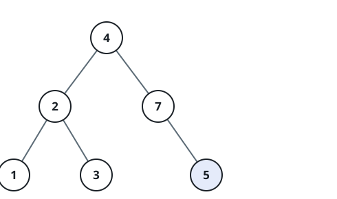
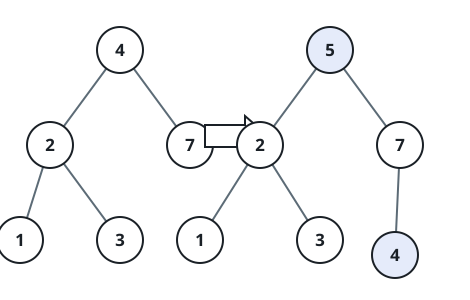

# Insert into a Binary Search Tree

## Description

You are given the `root` of a binary search tree (BST) and a value to insert
into the tree. Return the root of the BST after the insertion. It is
guaranteed that the new value does not exist in the original BST.

Insert the value as a new leaf: descend from the root, going right whenever
`val` is greater than the current node's value and left otherwise, and link a
fresh node into the first empty child slot the descent reaches. Below an
empty tree the fresh node simply is the root. The rest of the tree keeps its
exact shape — nothing is rotated or rebalanced — so the resulting tree is
determined by the input tree and `val`.

### Example 1



```text
Input: root = [4,2,7,1,3], val = 5
Output: [4,2,7,1,3,5]
```



### Example 2

```text
Input: root = [40,20,60,10,30,50,70], val = 25
Output: [40,20,60,10,30,50,70,null,null,25]
```

### Example 3

```text
Input: root = [4,2,7,1,3], val = 5
Output: [4,2,7,1,3,5]
```

### Constraints

- The number of nodes in the tree is in the range `[0, 10⁴]`.
- `-10⁸ <= Node.val <= 10⁸`
- All the values `Node.val` are unique.
- `-10⁸ <= val <= 10⁸`
- It is guaranteed that `val` does not exist in the original BST.
