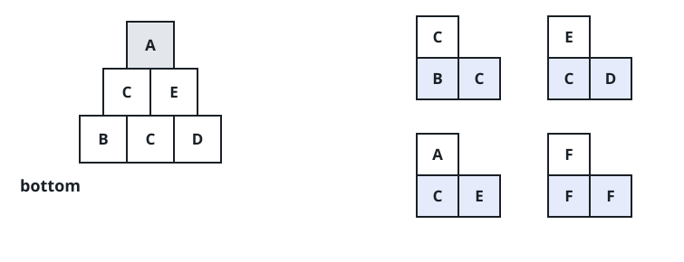
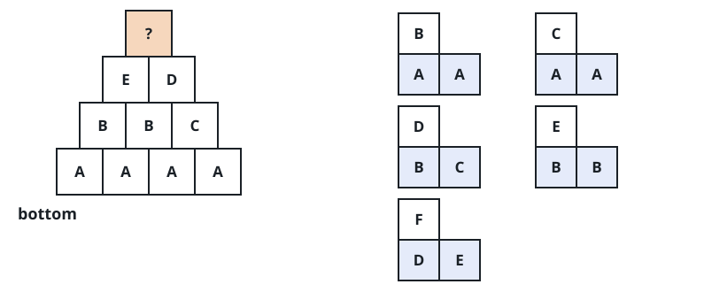

# Pyramid Transition Matrix

## Description

You are stacking colored blocks to form a pyramid. Each block's color is a
single letter. Every row of blocks holds one block fewer than the row
beneath it and sits centered on top.

For the pyramid to be valid, only specific triangular patterns may appear.
A triangular pattern is a single block stacked on top of two adjacent
blocks. The patterns are given in `allowed` as three-letter strings: the
first two characters name the left and right blocks underneath, and the
third character names the block placed on top. For instance, `"ABC"`
places a `C` on an `A` (left) and a `B` (right), which is different from
`"BAC"`, where `B` is the left block and `A` the right one.

You start with the bottom row `bottom`, given as a single string, and must
use it as the base of the pyramid. Every block you stack has to be the
third letter of an allowed pattern for the pair directly beneath it, so a
pair that no pattern starts with cannot carry any block at all.

Given `bottom` and `allowed`, return `true` if the pyramid can be built all
the way up to a single top block such that every triangular pattern in it
appears in `allowed`, or `false` otherwise.

### Example 1



```text
Input: bottom = "BCD", allowed = ["BCC","CDE","CEA","FFF"]
Output: true
Explanation: From the bottom row "BCD" we can build "CE" on the next level
and then "A" on top. The three triangular patterns in the pyramid are
"BCC", "CDE", and "CEA" — all of them allowed.
```

### Example 2



```text
Input: bottom = "AAAA", allowed = ["AAB","AAC","BCD","BBE","DEF"]
Output: false
Explanation: The row above "AAAA" can be built in several ways, but every
choice eventually gets stuck before a single top block can be placed.
```

### Constraints

- `2 <= bottom.length <= 6`
- `0 <= allowed.length <= 216`
- `allowed[i].length == 3`
- Every letter in `bottom` and in `allowed[i]` comes from the set
  `{'A', 'B', 'C', 'D', 'E', 'F'}`.
- All the strings in `allowed` are distinct.
