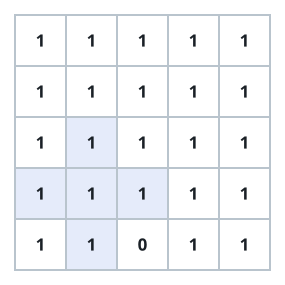
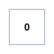

# Largest Plus Sign

## Description

You are given an integer `n`. You have an `n x n` binary grid `grid` with all
values initially `1`'s except for some indices given in the array `mines`.
The `ith` element of the array `mines` is defined as `mines[i] = [xi, yi]`
where `grid[xi][yi] == 0`.

Return the order of the largest axis-aligned plus sign of `1`'s contained in
`grid`. If there is none, return `0`.

An axis-aligned plus sign of `1`'s of order `k` has some center
`grid[r][c] == 1` along with four arms of length `k - 1` going up, down,
left, and right, and made of `1`'s. Note that there could be `0`'s or `1`'s
beyond the arms of the plus sign, only the relevant area of the plus sign is
checked for `1`'s.

### Example 1



```text
Input: n = 5, mines = [[4,2]]
Output: 2
Explanation: The largest plus sign can only be of order 2.
```

### Example 2



```text
Input: n = 1, mines = [[0,0]]
Output: 0
Explanation: There is no plus sign, so return 0.
```

### Constraints

- `1 <= n <= 500`
- `1 <= mines.length <= 5000`
- `0 <= xi, yi < n`
- All the pairs `(xi, yi)` are unique.

## Hints

### Hint 1

For each direction such as "left", find `left[r][c]` = the number of `1`'s
you will see before a zero starting at `(r, c)` and walking left. You can
find this in `n²` time with a dp. The largest plus sign at `(r, c)` is just
the minimum of `left[r][c]`, `up[r][c]`, etc.
