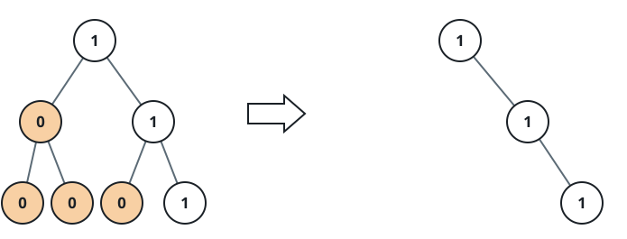

# Binary Tree Pruning

## Description

Given the `root` of a binary tree, return the same tree where every subtree
of the given tree not containing a 1 has been removed.

A subtree of a node `node` is `node` plus every node that is a descendant of
`node`.

### Example 1


```text
Input: root = [1,null,0,0,1]
Output: [1,null,0,null,1]
Explanation: the lone 0 leaf inside the right branch is a subtree with no 1
in it, so it is the only node removed.
```

### Example 2



```text
Input: root = [1,0,1,0,0,0,1]
Output: [1,null,1,null,1]
```

### Example 3


```text
Input: root = [1,1,0,1,1,0,1,0]
Output: [1,1,0,1,1,null,1]
```

### Constraints

- The number of nodes in the tree is in the range `[1, 200]`.
- `Node.val` is either `0` or `1`.
