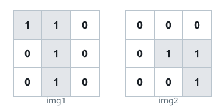
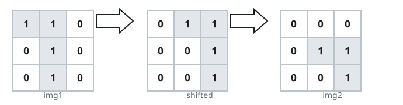
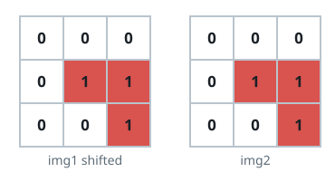

# Image Overlap

## Description

You are given two images, `img1` and `img2`, represented as binary square
matrices of size `n x n`. A binary matrix has only 0s and 1s as values.

We translate one image however we choose by sliding all the 1 bits left,
right, up, and/or down any number of units, then place it on top of the other
image. The overlap is the number of positions that have a 1 in both images.

Note also that a translation does not include any kind of rotation. Any 1
bits that are translated outside of the matrix borders are erased.

Return the largest possible overlap.

### Example 1







```text
Input: img1 = [[1,1,0],[0,1,0],[0,1,0]], img2 = [[0,0,0],[0,1,1],[0,0,1]]
Output: 3
Explanation: Translate img1 right by 1 unit and down by 1 unit; the number
of positions that have a 1 in both images is 3.
```

### Example 2

```text
Input: img1 = [[1]], img2 = [[1]]
Output: 1
```

### Example 3

```text
Input: img1 = [[0]], img2 = [[0]]
Output: 0
```

### Constraints

- `n == img1.length == img1[i].length`
- `n == img2.length == img2[i].length`
- `1 <= n <= 30`
- `img1[i][j]` is either `0` or `1`.
- `img2[i][j]` is either `0` or `1`.
