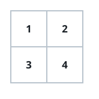
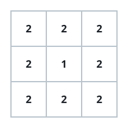

# Surface Area of 3D Shapes

## Description

You are given an `n x n` grid where you have placed some `1 x 1 x 1` cubes.
Each value `v = grid[i][j]` represents a tower of `v` cubes placed on top of
the cell `(i, j)`.

After placing these cubes, you have decided to glue any directly adjacent
cubes to each other, forming several irregular 3D shapes.

Return the total surface area of the resulting shapes.

Note: the bottom face of each shape counts toward its surface area.

### Example 1



```text
Input: grid = [[1,2],[3,4]]
Output: 34
Explanation: All four cells hold cubes, giving 8 horizontal faces. Each
tower's walls show only the part that rises above its neighbors — 2, 5, 8,
and 11 for the four towers — so the vertical faces add 26, for a total of
8 + 26 = 34.
```

### Example 2


```text
Input: grid = [[1,1,1],[1,0,1],[1,1,1]]
Output: 32
Explanation: The ring of eight towers has 16 horizontal faces, and its 12
outer walls add 12. The four walls facing the empty center cell add 4 more,
for 16 + 12 + 4 = 32.
```

### Example 3



```text
Input: grid = [[2,2,2],[2,1,2],[2,2,2]]
Output: 46
Explanation: Nine occupied cells give 18 horizontal faces, and the 12 outer
walls of height 2 add 24. Each of the four inner walls shows one unit above
the center tower of height 1, adding 4, for 18 + 24 + 4 = 46.
```

### Constraints

- `n == grid.length == grid[i].length`
- `1 <= n <= 50`
- `0 <= grid[i][j] <= 50`
