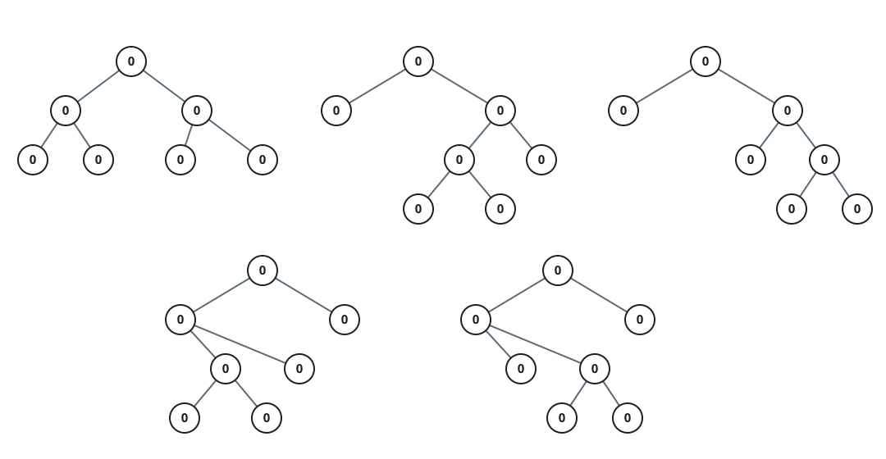

# All Possible Full Binary Trees

## Description

A full binary tree is a binary tree where each node has exactly 0 or 2
children.

Given an integer `n`, return a list of every possible full binary tree with
`n` nodes. Each node of each tree in the answer has value `0`, and each
element of the answer is the root of one such tree, rendered as its
level-order value list with `null` for a missing child.

Trees must come out in the order produced by this enumeration: for a size of
`n` nodes, try left-subtree sizes `1, 3, 5, …` ascending, and at each size
pair every left shape with every right shape — the shapes of each size
listed by this same rule, left shapes varying slowest.

A full binary tree always has an odd number of nodes — the root contributes
1 and every internal node adds a pair — so an even `n` admits no tree and
the answer is an empty list.

### Example 1



```text
Input: n = 7
Output: [[0,0,0,null,null,0,0,null,null,0,0],[0,0,0,null,null,0,0,0,0],[0,0,0,0,0,0,0],[0,0,0,0,0,null,null,null,null,0,0],[0,0,0,0,0,null,null,0,0]]
Explanation: Five full binary trees with 7 nodes exist. The first two give
the root a single-node left subtree and pair it with the two shapes a
5-node right subtree can take; the middle one splits the remaining 6 as 3
and 3; the last two mirror the first two with the 5-node shape on the left.
```

### Example 2

```text
Input: n = 3
Output: [[0,0,0]]
Explanation: With three nodes the root must be internal and both children
have nothing left to spend, so exactly one shape exists.
```

### Constraints

- `1 <= n <= 20`
