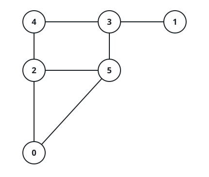

# Cat and Mouse

## Description

Two players, the Mouse and the Cat, play a game on an undirected graph and
take alternate turns. The graph is given as an adjacency list: `graph[a]` is
the list of all nodes `b` such that `ab` is an edge of the graph.

The Mouse starts at node `1` and moves first, the Cat starts at node `2` and
moves second, and there is a hole at node `0`.

During a player's turn, it must travel along one edge of the graph that meets
the node it stands on: if the Mouse is at node `1`, it must travel to any
node in `graph[1]`. Additionally, the Cat is not allowed to travel to the
hole (node `0`).

The game can end in three ways:

- If ever the Cat occupies the same node as the Mouse, the Cat wins.
- If ever the Mouse reaches the hole, the Mouse wins.
- If ever a position is repeated — the players stand in the same positions as
  on an earlier turn and it is the same player's turn to move — the game is a
  draw.

Given the `graph`, and assuming both players play optimally, return:

- `1` if the Mouse wins the game,
- `2` if the Cat wins the game, or
- `0` if the game is a draw.

### Example 1



```text
Input: graph = [[2,5],[3],[0,4,5],[1,4,5],[2,3],[0,2,3]]
Output: 0
Explanation: Neither player can force a win. The Cat can keep cycling between
the hole's two entrances (nodes 2 and 5), so the Mouse can never slip through
to node 0, while the Mouse can shuttle along the 3-4 edge and stay out of the
Cat's reach. Best play therefore repeats a position and the game is a draw.
```

### Example 2


```text
Input: graph = [[1,3],[0],[3],[0,2]]
Output: 1
Explanation: The Mouse starts at node 1, whose only neighbor is the hole at
node 0, so its very first move reaches the hole and wins the game.
```

### Constraints

- `3 <= graph.length <= 50`
- `1 <= graph[i].length < graph.length`
- `0 <= graph[i][j] < graph.length`
- `graph[i][j] != i`
- All values in `graph[i]` are unique.
- The Mouse and the Cat can always move.
