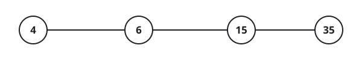
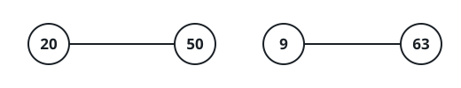
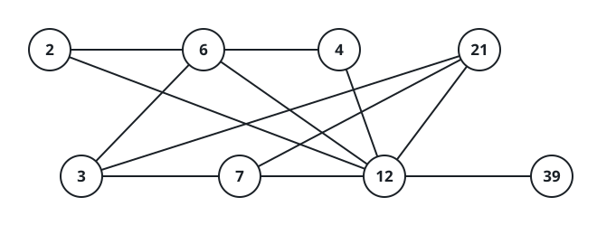

# Largest Component Size by Common Factor

## Description

You are given an array `nums` of unique positive integers. Consider the
undirected graph built over it: there is one node per value, and nodes `i`
and `j` are joined by an edge exactly when `nums[i]` and `nums[j]` share a
common factor greater than 1.

Return the size of the largest connected component in this graph.

### Example 1



```text
Input: nums = [4,6,15,35]
Output: 4
Explanation: 4 and 6 share the factor 2, 6 and 15 share 3, and 15 and 35
share 5, so one chain of pairwise-shared factors links all four values
into a single component.
```

### Example 2



```text
Input: nums = [20,50,9,63]
Output: 2
Explanation: 20 and 50 share the factors 2 and 5, while 9 and 63 share the
factor 3; the two pairs share nothing with each other, so the largest
component holds 2 nodes.
```

### Example 3



```text
Input: nums = [2,3,6,7,4,12,21,39]
Output: 8
Explanation: The even values 2, 4, 6, and 12 share the factor 2, the
multiples of 3 among them share 3, and 7 meets 21 over 7; every value ends
up in one component of 8 nodes.
```

### Constraints

- `1 <= nums.length <= 2 * 10⁴`
- `1 <= nums[i] <= 10⁵`
- All the values of `nums` are unique.
