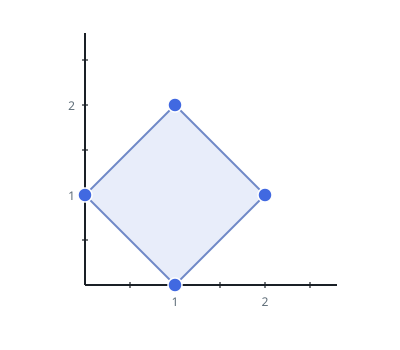
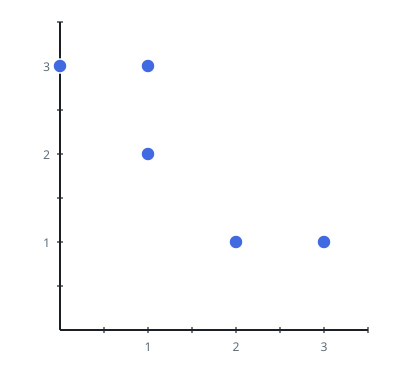

# Minimum Area Rectangle II

## Description

You are given an array of points in the X-Y plane, `points`, where
`points[i] = [xi, yi]`.

Return the minimum area of a rectangle formed from these points, with sides
not necessarily parallel to the X and Y axes. Any orientation qualifies: the
only requirement is that all four corners of the rectangle belong to
`points`. If there is not any such rectangle, return `0`.

Answers within `10⁻⁵` of the actual answer will be accepted.

### Example 1



```text
Input: points = [[1,2],[2,1],[1,0],[0,1]]
Output: 2.00000
Explanation: The minimum area rectangle occurs at [1,2],[2,1],[1,0],[0,1],
with an area of 2. Its sides sit at 45 degrees to the axes.
```

### Example 2


```text
Input: points = [[0,1],[2,1],[1,1],[1,0],[2,0]]
Output: 1.00000
Explanation: The minimum area rectangle occurs at [1,0],[1,1],[2,1],[2,0],
with an area of 1.
```

### Example 3



```text
Input: points = [[0,3],[1,2],[3,1],[1,3],[2,1]]
Output: 0
Explanation: There is no possible rectangle to form from these points.
```

### Constraints

- `1 <= points.length <= 50`
- `points[i].length == 2`
- `0 <= xi, yi <= 4 * 10⁴`
- All the given points are unique.
