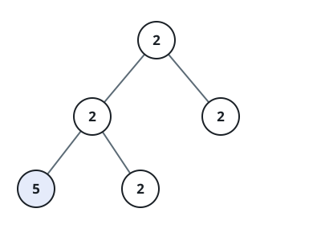

# Univalued Binary Tree

## Description

A binary tree is uni-valued if every node in the tree has the same value.

Given the `root` of a binary tree, return `true` if the given tree is
uni-valued, or `false` otherwise.

### Example 1


```text
Input: root = [1,1,1,1,1,null,1]
Output: true
Explanation: Every node of the tree carries the value 1.
```

### Example 2



```text
Input: root = [2,2,2,5,2]
Output: false
Explanation: The node carrying 5 disagrees with the 2 every other node has.
```

### Constraints

- The number of nodes in the tree is in the range `[1, 100]`.
- `0 <= Node.val < 100`
