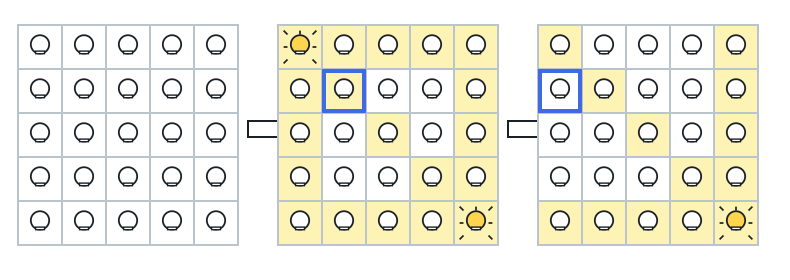
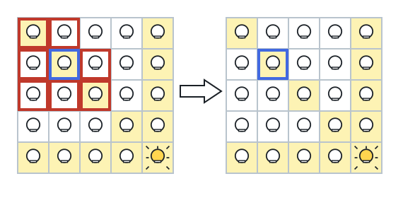
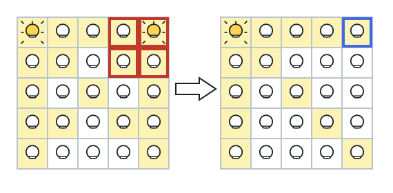

# Grid Illumination

## Description

There is a 2D grid of size `n x n` where each cell of this grid has a lamp
that is initially turned off.

You are given a 2D array of lamp positions `lamps`, where
`lamps[i] = [rowi, coli]` indicates that the lamp at `grid[rowi][coli]` is
turned on. Even if the same lamp is listed more than once, it is turned on.

When a lamp is turned on, it illuminates its cell and all other cells in
the same row, column, or diagonal.

You are also given another 2D array `queries`, where
`queries[j] = [rowj, colj]`. For the `jth` query, determine whether
`grid[rowj][colj]` is illuminated or not. After answering the `jth` query,
turn off the lamp at `grid[rowj][colj]` and its 8 adjacent lamps if they
exist. A lamp is adjacent if its cell shares either a side or corner with
`grid[rowj][colj]`.

Return an array of booleans `ans`, where `ans[j]` should be `true` if the
cell in the `jth` query was illuminated, or `false` if it was not.

### Example 1







```text
Input: n = 5, lamps = [[0,0],[4,4]], queries = [[1,1],[1,0]]
Output: [true,false]
Explanation: We have the initial grid with all lamps turned off. We turn on
the lamp at grid[0][0] then turn on the lamp at grid[4][4].
The 0th query asks if the lamp at grid[1][1] is illuminated or not. It is
illuminated, so set ans[0] = true. Then, we turn off all lamps in the 3x3
square centered at grid[1][1] (only grid[0][0] is a lamp there).
The 1st query asks if the lamp at grid[1][0] is illuminated or not. It is
not illuminated, so set ans[1] = false. Then, we turn off all lamps in the
3x3 square centered at grid[1][0] (there are none left there).
```

### Example 2

```text
Input: n = 5, lamps = [[0,0],[4,4]], queries = [[1,1],[1,1]]
Output: [true,true]
```

### Example 3

```text
Input: n = 5, lamps = [[0,0],[0,4]], queries = [[0,4],[0,1],[1,4]]
Output: [true,true,false]
```

### Constraints

- `1 <= n <= 10^9`
- `0 <= lamps.length <= 20000`
- `0 <= queries.length <= 20000`
- `lamps[i].length == 2`
- `0 <= rowi, coli < n`
- `queries[j].length == 2`
- `0 <= rowj, colj < n`
