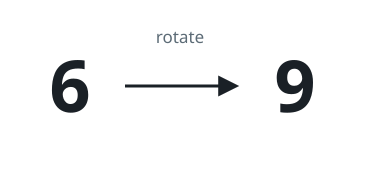
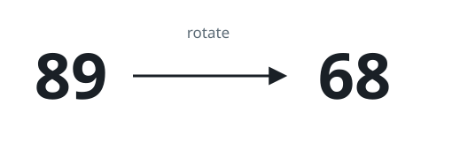
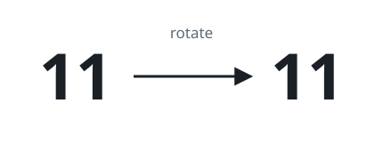

# Confusing Number

## Description

A confusing number is a number that when rotated 180 degrees becomes a
different number with each digit valid.

We can rotate digits of a number by 180 degrees to form new digits.

- When 0, 1, 6, 8, and 9 are rotated 180 degrees, they become 0, 1, 9, 8,
  and 6 respectively.
- When 2, 3, 4, 5, and 7 are rotated 180 degrees, they become invalid.

Note that after rotating a number, we can ignore leading zeros.

- For example, after rotating 8000, we have 0008 which is considered as
  just 8.

Given an integer `n`, return `true` if it is a confusing number, or
`false` otherwise.

### Example 1



```text
Input: n = 6
Output: true
Explanation: We get 9 after rotating 6, 9 is a valid number, and 9 != 6.
```

### Example 2



```text
Input: n = 89
Output: true
Explanation: We get 68 after rotating 89, 68 is a valid number and 68 != 89.
```

### Example 3



```text
Input: n = 11
Output: false
Explanation: We get 11 after rotating 11, 11 is a valid number but the
value remains the same, thus 11 is not a confusing number.
```

### Constraints

- `0 <= n <= 10⁹`

## Hints

### Hint 1

Reverse each digit with their corresponding new digit if an invalid
digit is found the return -1. After reversing the digits just compare
the reversed number with the original number.
