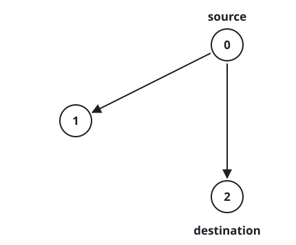

# All Paths from Source Lead to Destination

## Description

Given the edges of a directed graph where `edges[i] = [ai, bi]` indicates
there is an edge between nodes `ai` and `bi`, and two nodes `source` and
`destination` of this graph, determine whether or not all paths starting
from `source` eventually, end at `destination`, that is:

- At least one path exists from the `source` node to the `destination`
  node
- If a path exists from the `source` node to a node with no outgoing
  edges, then that node is equal to `destination`.
- The number of possible paths from `source` to `destination` is a finite
  number.

Return `true` if and only if all roads from `source` lead to
`destination`.

### Example 1



```text
Input: n = 3, edges = [[0,1],[0,2]], source = 0, destination = 2
Output: false
Explanation: It is possible to reach and get stuck on both node 1 and node 2.
```

### Example 2


```text
Input: n = 4, edges = [[0,1],[0,3],[1,2],[2,1]], source = 0, destination = 3
Output: false
Explanation: We have two possibilities: to end at node 3, or to loop over node 1 and node 2 indefinitely.
```

### Example 3


```text
Input: n = 4, edges = [[0,1],[0,2],[1,3],[2,3]], source = 0, destination = 3
Output: true
```

### Constraints

- `1 <= n <= 10⁴`
- `0 <= edges.length <= 10⁴`
- `edges[i].length == 2`
- `0 <= ai, bi <= n - 1`
- `0 <= source <= n - 1`
- `0 <= destination <= n - 1`
- The given graph may have self-loops and parallel edges.

## Hints

### Hint 1

What if we can reach to a cycle from the source node?

### Hint 2

Then the answer will be false, because we eventually get trapped in the
cycle forever.

### Hint 3

What if the we can't reach to a cycle from the source node? Then we need
to ensure that from all visited nodes from source the unique node with
indegree = 0 is the destination node.
