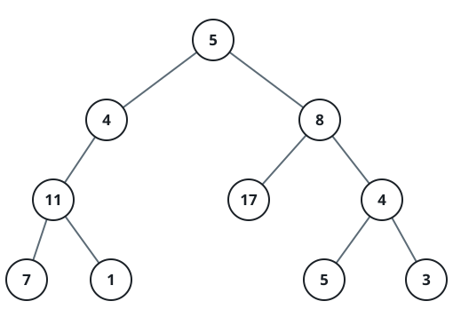

# Insufficient Nodes in Root to Leaf Paths

## Description

Given the root of a binary tree and an integer `limit`, delete all
insufficient nodes in the tree simultaneously, and return the root of the
resulting binary tree.

A node is insufficient if every root to leaf path intersecting this node
has a sum strictly less than `limit`.

A leaf is a node with no children.

### Example 1


```text
Input: root = [1,2,3,4,-99,-99,7,8,9,-99,-99,12,13,-99,14], limit = 1
Output: [1,2,3,4,null,null,7,8,9,null,14]
```

### Example 2



```text
Input: root = [5,4,8,11,null,17,4,7,1,null,null,5,3], limit = 22
Output: [5,4,8,11,null,17,4,7,null,null,null,5]
```

### Example 3


```text
Input: root = [1,2,-3,-5,null,4,null], limit = -1
Output: [1,null,-3,4]
```

### Constraints

- The number of nodes in the tree is in the range `[1, 5000]`.
- `-10⁵ <= Node.val <= 10⁵`
- `-10⁹ <= limit <= 10⁹`

## Hints

### Hint 1

Consider a DFS traversal of the tree. You can keep track of the current
path sum from root to this node, and you can also use DFS to return the
maximum value of any path from this node to the leaf. This will tell you
if this node is insufficient.
