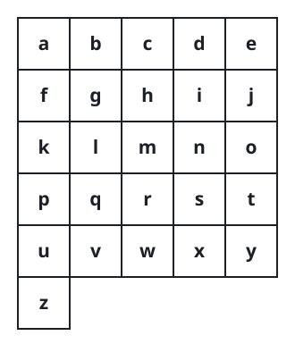

# Alphabet Board Path

## Description

On an alphabet board, we start at position `(0, 0)`, corresponding to
character `board[0][0]`.

Here, `board = ["abcde", "fghij", "klmno", "pqrst", "uvwxy", "z"]`, as shown
in the diagram below.



```text
a  b  c  d  e
f  g  h  i  j
k  l  m  n  o
p  q  r  s  t
u  v  w  x  y
z
```

We may make the following moves:

- `'U'` moves our position up one row, if the position exists on the board;
- `'D'` moves our position down one row, if the position exists on the
  board;
- `'L'` moves our position left one column, if the position exists on the
  board;
- `'R'` moves our position right one column, if the position exists on the
  board;
- `'!'` adds the character `board[r][c]` at our current position `(r, c)` to
  the answer.

(Here, the only positions that exist on the board are positions with letters
on them.)

Return a sequence of moves that makes our answer equal to `target` in the
minimum number of moves. You may return any path that does so.

### Example 1

```text
Input: target = "leet"
Output: "DDR!UURRR!!DDD!"
```

### Example 2

```text
Input: target = "code"
Output: "RR!DDRR!UUL!R!"
```

### Constraints

- `1 <= target.length <= 100`
- `target` consists only of English lowercase letters.

## Hints

### Hint 1

Create a hashmap from letter to position on the board.

### Hint 2

Now for each letter, try moving there in steps, where at each step you check
if it is inside the boundaries of the board.
